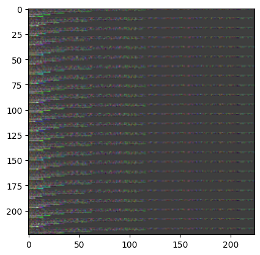

# Deep Learning course
## University of Padua, 2025

#### Authored by Loris Nanni and Daniel Fusaro

---

This is the official repository of the vector2image challenge!

You should modify only the vector2image_DWT function <b>OR</b> vector2image_CWT function inside the game.ipynb notebook.

The notebook will use functions from the utils/ folder and the data from the datasets/ folder.

Then, upload your function (either just the function or the full notebook) to the DropBox link that you find the instruction in the moodle.
You must deliver also a short and simple report that describes your solution and the performance.

If you have any doubt, contact us!

---
## Requirements

1) You should use an Ubuntu system (from 18.04 to 24.04 are fine)

2) It's better if you setup a virtual environment (follow these steps)

```shell
# Install git, Python 3 and venv
sudo apt update
sudo apt install git python3 python3-venv python3-pip -y 

# Clone this repo
cd /path/to/your/project  
git clone https://github.com/Bender97/vector2image_game.git

# Create a Virtual Environment
python3 -m venv venv      # Creates a virtual environment named 'venv'

# Activate it
source venv/bin/activate

# Update pip
pip install --upgrade pip

# Install torch (PAY ATTENTION to your CUDA version! e.g., here is Cuda 11.8)
# If in doubt, follow
#  - for latest version:    https://pytorch.org/get-started/locally/
#  - for previous versions: https://pytorch.org/get-started/previous-versions/
pip install torch torchvision --index-url https://download.pytorch.org/whl/cu118

# Install all requirements
pip install -r requirements.txt

```
--- 

Example of a vector 2 image transformation using the DWT baseline function.




---

We thank the author of the datasets used in this project:

### Blood-Brain Barrier (BBB) permeability compounds
```latex
@article{shaker2020bio,
    author = {Shaker, Bilal and Yu, Myeong-Sang and Song, Jin Sook and Ahn, Sunjoo and Ryu, Jae Yong and Oh, Kwang-Seok and Na, Dokyun},
    title = {LightBBB: computational prediction model of blood–brain-barrier penetration based on LightGBM},
    journal = {Bioinformatics},
    volume = {37},
    number = {8},
    pages = {1135-1139},
    year = {2020},
    month = {10},
    issn = {1367-4803},
    doi = {10.1093/bioinformatics/btaa918},
}
```

### Anti-Cancer Peptides (ACP)
```latex
@article{jiang2023tcbb,
  author={Jiang, Likun and Sun, Nan and Zhang, Yue and Yu, Xinyu and Liu, Xiangrong},
  journal={IEEE/ACM Transactions on Computational Biology and Bioinformatics}, 
  title={Bioactive Peptide Recognition Based on NLP Pre-Train Algorithm}, 
  year={2023},
  volume={20},
  number={6},
  pages={3809-3819},
  doi={10.1109/TCBB.2023.3323295}
}
```